<p align="center">
  
</p>

---

```text
$ whoami

i make things for the small annoyances that somehow survive
in big software: missing media buttons, players that hate TV
remotes, settings that won't explain themselves, trackers
that should be more fun than a spreadsheet.

most projects start with one question:

    > why is this not already a button?

...and end up with a little more taste than strictly necessary.
```

## The Shelf

### mpvNova

An Android TV-first mpv fork — custom player UI, decoder modes, audio shaping, subtitle controls, and updates pulled from GitHub releases. Built so a media player can actually feel good from the couch.

→ [`Laskco/mpvNova`](https://github.com/Laskco/mpvNova)

### YouTube Fast Forward & Rewind

A browser extension that adds clickable fast-forward and rewind buttons to YouTube. For when timeline jumps shouldn't be a guessing game.

→ [`Laskco/YouTube-Fast-Forward-and-Rewind`](https://github.com/Laskco/YouTube-Fast-Forward-and-Rewind)

### Shiny Tracker

A retro Pokémon shiny-hunting tracker. Encounters, odds, timers, history — in a UI that feels like a little machine, not homework.

→ [`Laskco/Shiny-Tracker`](https://github.com/Laskco/Shiny-Tracker)

## Build Taste

```text
remote-first TV controls
clear release notes
settings that tell the truth
media tooling that respects weird edge cases
retro UI when it fits, restraint when it doesn't
```

## Support

| | |
| --- | --- |
| Coffee | [buymeacoffee.com/laskco](https://buymeacoffee.com/laskco) |
| PayPal | [donation link](https://www.paypal.com/donate/?hosted_button_id=R87TNQANCT8KN) |
